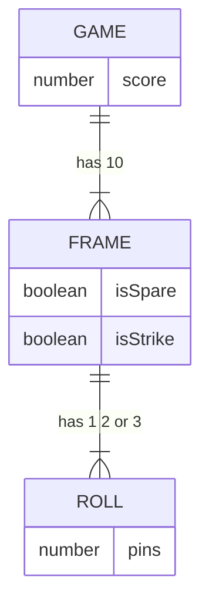

---
hideInToc: true
---

# Agenda

<Toc maxDepth="1" />

---
layout: image-left
image: ./stuck.webp
---

# How to avoid getting stuck?

Getting stuck happens.

**We'll look at the following techniques:**

<v-clicks>

- 🏌🏿‍♂️ Code golf
- 🕴🏽 Fake it 'til you make it
- 🪜 Stepping stones
- ➕ Single logical assertion
- 🦹🏻‍♀️ Degenerate first

</v-clicks>

---
---

# Getting stuck ➡ Word wrap

Let's write a function called `wrap`

<v-clicks>

**This function will:**

- accept a `words` string and a `width` number
- return a string mutating `words` where:
  - newlines are introduced that ensure no line is longer than the `width`
  - newlines are introduced at places that don't cut any words in half

</v-clicks>

---
---

## Simple design

We should always start with a simple design, this will give us some guidance

<v-clicks>

**A simple design for this unit is the method signature...**

```ts
wrap(words: string, width: number): string
```

This is more than enough design to get started

</v-clicks>

---
---

## Download and install the project

First `cd` to a location on your machine where you will put the `tdd-demo` app

Then run the following:

```bash
git clone git@github.com:beamery-tomht/tdd-demo.git
cd tdd-demo
nvm use
yarn
```

---
---

## Setup a test environment

Let's make a test file

```bash
mkdir src/utils
touch src/utils/wrap.test.ts
```

And open VSCode in this directory

```bash
code .
```

<br />

> NB: if the above command doesn't work...
>
> Open VSCode, open the command pallet with `cmd+shift+p` and type `install`
>
> Then choose `Shell Command: Install 'code' command in PATH`

---

## Let's get tests working

Open the `wrap.test.ts` file and enter the following

```ts
import { expect } from "chai";

describe.only(`Wrap`, () => {
  it(`executes`, () => {
    expect(true).to.eql(false);
  });
});
```

Now you can start the tests and see this fail

```bash
yarn test:unit:dev
```

---
---

## Now follow along...

Let's try TDD to design this solution

---
layout: image-left
image: ./stuck-cat.webp
---

## We got stuck

<v-click>

What did we do?

</v-click>

<v-clicks>

- ✅ Red green refactor
- ✅ Stepping stones
- ✅ Code golf
- ✅ Fake it 'til you make it
- ✅ Single logical assertion

</v-clicks>

<v-click>

What didn't we do?

</v-click>

<v-clicks>

- ❌ We didn't follow incremental approach
- ❌ Simplest possible failing test
- ❌ Degenerate tests first

</v-clicks>

---
layout: image-left
image: ./degeneres.webp
---

# Degenerate first

The most simple cases are supplying nothing, errors, degenerate cases...

> "Degenerate case"
>
> A limiting case of a class of objects which appears to be qualitatively different from (and usually simpler than) the rest of the class

For example, calling methods with `null`, `undefined`, empty string, etc...

This also applies to error responses from servers when making API calls, DB queries, etc......

---
---

## The Specific/Generic cycle

**As the test gets more specific... the code gets more generic**

Degenerate cases are the most simple absurdities

Covering these first leads us to a more incremental and sound design

<v-click>

{class=meme}

</v-click>

<style>
  .meme {
    height: 200px;
  }
</style>

---
---

## Let's try again...

But this time, we will:

- Go iteratively taking tiny steps
- Gradually increase test specificity
- Starting with degenerate cases

---
---

# Simple design ➡ Bowling game

Build a class that registers the frames for a single player in a bowling game

Must follow the rules of 10 pin bowling

Calculates the score for a player who has completed 10 frames

---
---

## The rules of bowling

- The player can play 10 frames
- By default, a player gets 2 rolls per frame
- The score for each frame is the sum of pins knocked down
- If the score totals 10 from 2 rolls, the player has scored a spare
  - The next roll is added to the frame score of a spare
- If the score totals 10 from the first roll, the player has scored a strike
  - The player doesn't get a second roll after a strike
  - The next 2 rolls are added to the frame score of a strike
- If the player scores a spare in the last frame, they get 1 more roll
- If the player scores a strike in the last frame, they get 2 more rolls
- A "perfect game" consists of 12 rolls and a score of 300

---
---

## Simple design

Let's make a simple entity relationship diagram to help us get started



---
---

# Practice ➡ Name inverter

A function that accepts a `name` string and inverts it

- It should swap first name and last name - placing a comma between
- It should remove empty spaces around names
- It should persist honourifics at the start of names
- It should keep postnominals at the end of names

---
---

# Advanced ➡ UI Integration tests

Coming soon...
